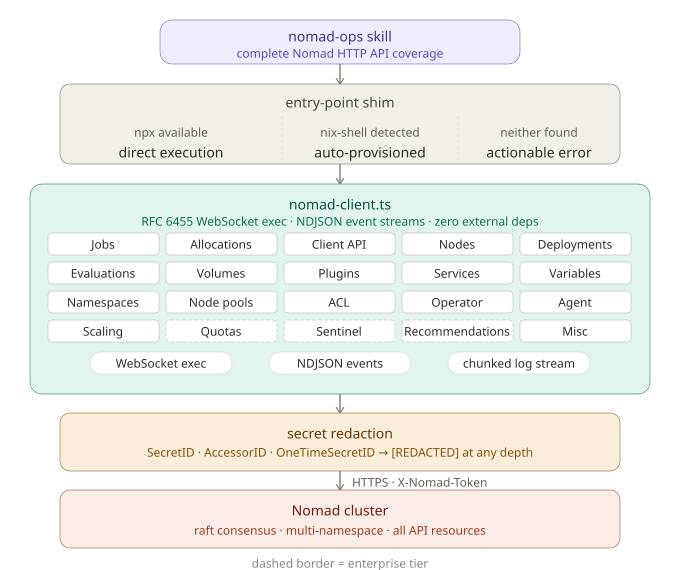

# Nomad Ops Skill

A senior-grade agent skill for comprehensive Nomad cluster operations and administration.

<p align="center">
  <picture>
    <source media="(prefers-color-scheme: dark)" srcset="docs/architecture-dark.svg">
    
  </picture>
</p>

## Why a "Skill" and not an MCP?

Architectural decisions in agentic workflows significantly impact performance and cost. This project is implemented as a **Skill** rather than a Model Context Protocol (MCP) server for several critical reasons:

1. **Token Efficiency:** MCP servers often require persistent context or "chatty" communication patterns between the agent and the server. As a Skill, this codebase is designed to be **context-compressed**. The entire Nomad API surface is implemented in a single, well-structured file (`scripts/nomad-client.ts`), allowing the agent to hold the full architectural map in a single turn.
2. **On-Demand Execution:** Skills are invoked only when needed. There is no background process to manage or keep alive.
3. **Native Performance:** By leveraging Node.js 24's native TypeScript execution (`--experimental-transform-types`), the `nomad-ops` CLI provides near-instant startup times without the overhead of heavy compilation steps.
4. **Environment Portability:** The included `nix-shell` auto-provisioning ensures the tool works identically across developer machines and CI/CD pipelines without manual dependency management.

For a detailed analysis of the performance metrics and architectural design, see the [**Technical Whitepaper: Architectural Efficiency in Agentic Nomad Operations**](docs/WHITEPAPER.md).

## Token Efficiency

This skill is designed to minimize context bloat. Beyond architectural compression, it provides CLI-native optimization flags:

- **Server-side Filtering:** `--filter 'Status == "running"'` (reduces data at the source).
- **Field Projection:** `--fields ID,Status` (returns only high-signal data).
- **Table Formatting:** `--short` or `--format table` (Markdown tables are ~70% more token-efficient than JSON).
- **Safety Limits:** Automated 50-item cap on lists (overridable with `--limit N`).

## Key Features

- **100% API Coverage:** Complete implementation of all Nomad v1.11+ endpoints (Jobs, Allocs, Nodes, CSI, ACLs, Vars, etc.).
- **Security First:** Mandatory secret redaction subsystem. Sensitive keys like `SecretID` and `Token` are automatically scrubbed from all CLI output.
- **Smart CSI Operations:** Position-based volume commands with auto-lookup for PluginID and Namespace.
- **Quiet Runtime:** Suppressed Node.js warnings and cleaner CLI output for agent context preservation.
- **Protocol Native:** Custom RFC 6455 WebSocket implementation for `exec` and chunked HTTP handlers for real-time log streaming—zero external npm dependencies.
- **Smart Runtime:** Automatically detects the best way to run (Node 24 native, `ts-node`, or `nix-shell` fallback).

## Installation

Run the installer once to place the `nomad-ops` binary in your path:

```bash
bash install.sh
```

The installer creates a symlink at `~/.local/bin/nomad-ops` pointing to the entry-point shim.

## Usage

Ensure your environment is configured with your Nomad address and token:

```bash
export NOMAD_ADDR="https://your-nomad-cluster:4646"
export NOMAD_TOKEN="your-acl-token"
```

### Common Commands

```bash
# List jobs across all namespaces
nomad-ops jobs list

# Submit a job
nomad-ops jobs submit my-app.nomad

# Tail logs for a specific task
nomad-ops alloc logs <alloc_id> <task_name>

# Exec into a running task
nomad-ops client exec <alloc_id> <task_name> -- /bin/sh

# Manage variables/secrets
nomad-ops var read path/to/secret
```

## Security Guardrails

The `nomad-ops` client is built with a hard mandate to protect cluster integrity:
- **Redaction:** Recursive walker scrubs secrets at any depth in JSON responses.
- **Auth Safety:** Error messages never leak portions of the `NOMAD_TOKEN`.
- **Immutability:** The client never modifies environment variables or local shell state.

## Repository Layout

- `scripts/nomad-client.ts`: The entire API client in one file for maximum agent context efficiency.
- `scripts/nomad`: Entry-point shim with runtime detection and `nix-shell` logic.
- `install.sh`: Location-independent symlink installer.
- `references/`: Sparse-cloned HCL and API documentation for just-in-time agent research.
